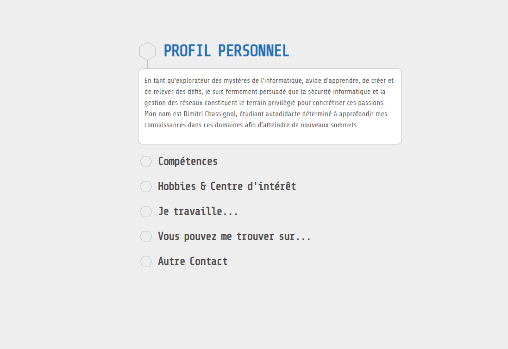

# Portfolio de Dimitri Chassignol [BTS SIO Grp2]

Bienvenue sur mon portfolio interactif ! 🚀

Hello, voici mon projet HTML/CSS dynamique ! Explorez mes compétences, et plongez dans mon parcours professionnel. Ce portfolio est bien plus qu'un simple CV, c'est une fenêtre virtuelle sur mon monde professionnel et mes passions.

🔍 Explorez | 🧠 Apprenez | 🤝 Connectez-vous !

***Projet : Centre de Formation Saint-Etienne (CFAI)***

## Aperçu du PROJET

{:target="_blank"}

## Technologies utilisées

- HTML
- CSS
- JavaScript (jQuery)

## Fonctionnalités

- Présentation du profil personnel
- Liste des compétences
- Hobbies et centres d'intérêt
- Informations sur mon travail actuel
- Liens vers mes profils sur les réseaux sociaux et contacts

## Comment utiliser

1. Cloner le dépôt : `git clone [https://github.com/DITSHOOT/1SIOGrp2-CV-.git]`
2. Ouvrir le fichier `index.html` dans un navigateur web.

## Auteur

- Dimitri Chassignol

## Contact

Pour toute question ou collaboration, n'hésitez pas à me contacter : contact@dimitrichassignol.fr.

---
*Créé avec ❤️ par Dimitri Chassignol - 2024*

